# Autonomous Navigation Robot
## Robot with SLAM & Autonomous Navigation
<br>

___________________________________________________________________________

# **Details About Project**

## Software Used
- Fusion360 -> For designing the 3D Model of the robot.
- [fusion2urdf](https://github.com/syuntoku14/fusion2urdf) -> Fusion360 script to export urdf from fusion 360 directly. 
- ROS - Noetic 
- Gazebo 
- Rviz 

Robot Drive Plugin Used - [Differential Drive - Gazebo](http://gazebosim.org/tutorials?tut=ros_gzplugins#DifferentialDrive)

## Fusion360 Model
<div align="center">

<br />
</div>

## Clone this repository inside your ROS Workspace:
```
cd ~/catkin_ws/src/
git clone https://github.com/nilutpolkashyap/auto_nav_robot.git
cd ~/catkin_ws/
catkin_make
source devel/setup.bash
```

## Launch the simulation and visualization
Type the command in a terminal to launch the Robot Navigation world simulation:
```
roslaunch bug_robot_description gazebo.launch
```
<div align="center">
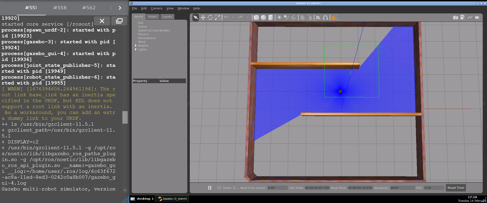</div><br />

Type the command in another terminal to run the RVIZ visualization:
```
roslaunch bug_robot_description rviz.launch
```
<div align="center">
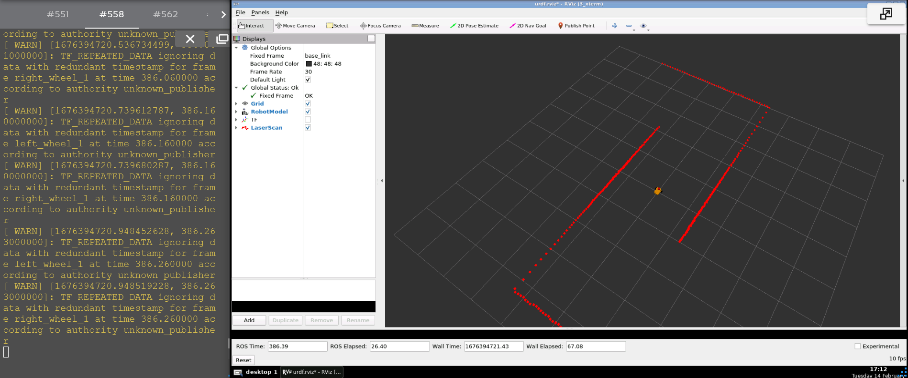</div>


## Launch SLAM - Gmapping
Type the command in a terminal to launch the Robot Navigation world simulation:
```
roslaunch bug_robot_description navigation_sim.launch
```
<div align="center">
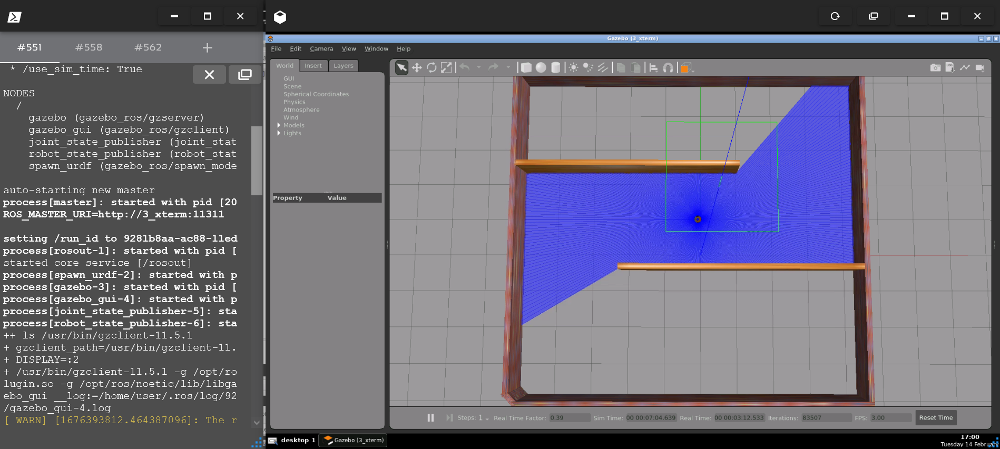</div><br />

Type the command in another terminal to run the Gmapping SLAM node:
```
roslaunch bug_robot_navigation gmapping_slam.launch
```
<div align="center">
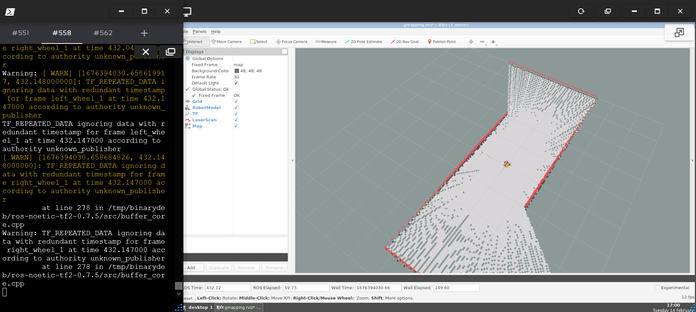</div>

Type the command in another terminal to run teleoperation node and move the robot around the area to create the map:
```
rosrun teleop_twist_keyboard teleop_twist_keyboard.py
```

When the map is created successfully, open a new terminal and type the command to save the map:
```
rosrun map_server map_saver -f ~/map
```
<div align="center">
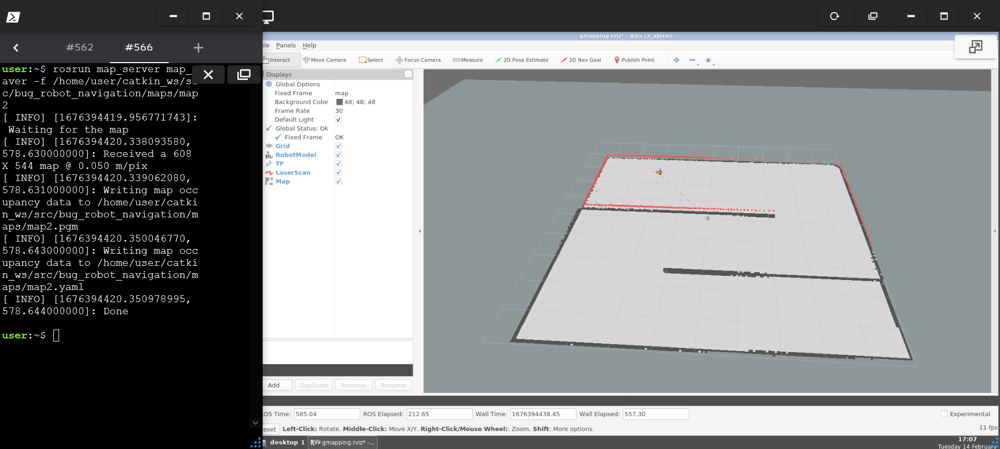</div>

## Run Autonomous Navigation
Type the command in a terminal to launch the Robot Navigation world simulation:
```
roslaunch bug_robot_description navigation_sim.launch
```
<div align="center">
</div><br />

Type the command in another terminal to run the Navigation node:
```
roslaunch bug_robot_navigation navigation.launch
```
<div align="center">
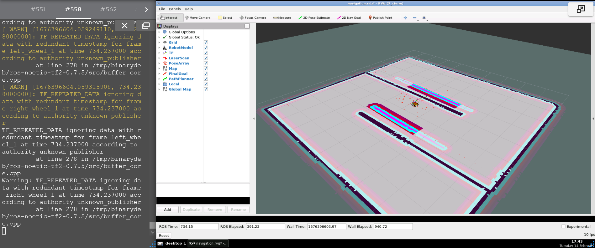</div>

### Estimate Initial Pose
Initial Pose Estimation must be performed before running the Navigation as this process initializes the AMCL parameters that are critical in Navigation. 
1. Click the 2D Pose Estimate button in the RViz menu.

<div align="center">
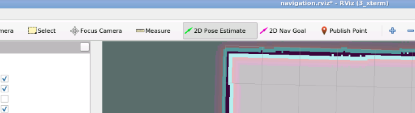</div>

2. Click on the map where the actual robot is located and drag the large green arrow toward the direction where the robot is facing.
<div align="center">
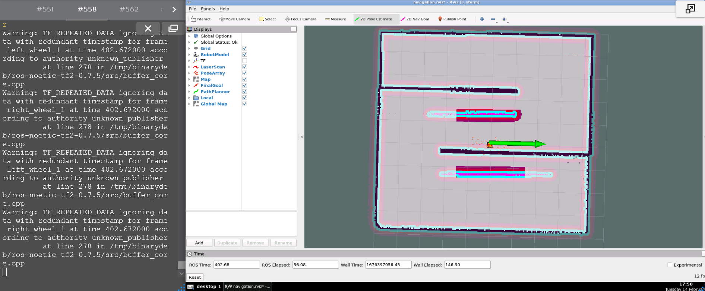</div>

### Set Navigation Goal
1. Click the 2D Nav Goal button in the RViz menu. 

<div align="center">
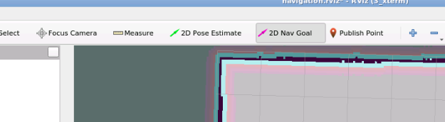</div>

2. Click on the map to set the destination of the robot and drag the green arrow toward the direction where the robot will be facing. 

<div align="center">
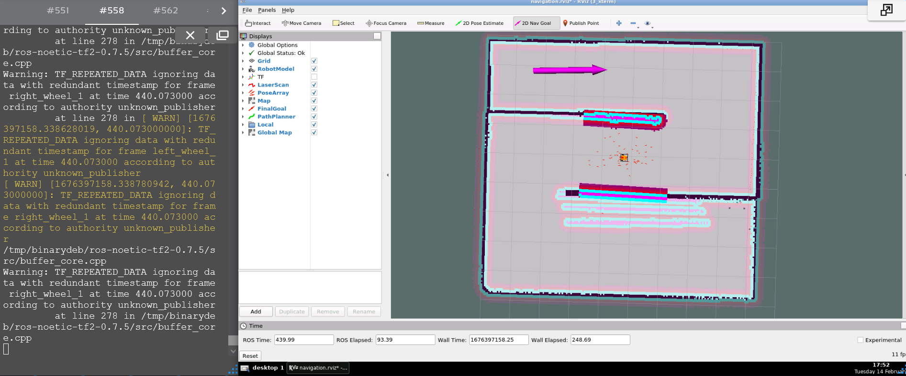</div>

## Output - Autonomus Navigation
<div align="center">
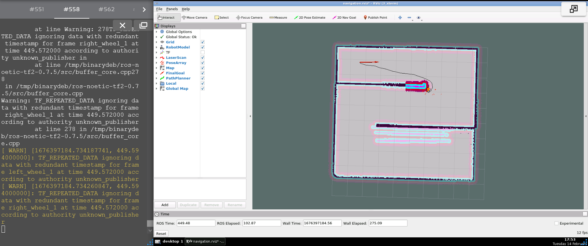</div>

